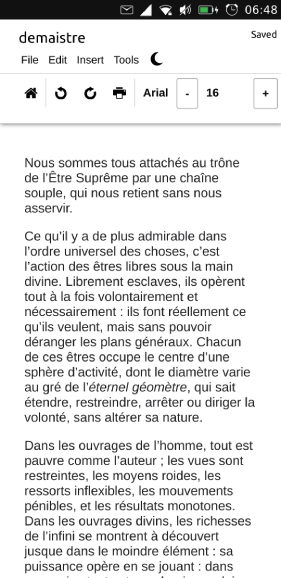
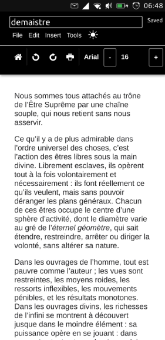

# LightP Word Processor


(icon by the [Numix Project](https://github.com/numixproject/numix-icon-theme-square) - GPL-3.0)

[](https://open-store.io/app/lightp.collaproductions)
[](https://t.me/collaproductions)

LightP is a simple HTML5 word processor for Ubuntu Touch based on the work of [NotTimTam](https://github.com/NotTimTam/LightP). It is compatible with the .rtf format but, unfortunately, at this moment it is only compatible with files that have been created by itself. You can use [Document Viewer](https://open-store.io/app/com.ubuntu.docviewer) to read other files.

Documents are stored in the /home/phablet/.local/share/lightp.collaproductions/Downloads directory by default. If you would prefer to have your documents inside your ~/Documents directory, you can delete the original folder and turn it into a symlink to the latter:

```
$ rm -rf ~/.local/share/lightp.collaproductions/Downloads
$ ln -s ~/Documents ~/.local/share/lightp.collaproductions/Downloads
```

This will make sure your documents are stored in your ~/Documents folder. If you want to pick a different directory, change your command accordingly.

### Building the app (Ubuntu-based distros)

Install [clickable](https://clickable-ut.dev/en/latest/install.html):

```
$ sudo add-apt-repository ppa:bhdouglass/clickable
$ sudo apt-get install clickable
```

Clone this repository and build:

```
$ git clone https://github.com/nicolascolla/LightP.git
$ cd LightP/lightp
$ clickable
```

The resulting click package will be found under build/all/app.

### Building instructions for 16.04

Install [clickable](https://clickable-ut.dev/en/latest/install.html):

```
$ sudo add-apt-repository ppa:bhdouglass/clickable
$ sudo apt-get install clickable
```

Clone this repository, change the framework and build:

```
$ git clone https://github.com/nicolascolla/LightP.git
$ cd LightP/lightp
$ sed -i 's/ubuntu-sdk-20.04/ubuntu-sdk-16.04.5/' clickable.json
$ sed -i 's/20.04/16.04/' lightp.apparmor
$ clickable
```

The resulting click package will be found under build/all/app.

### Screenshots

 
